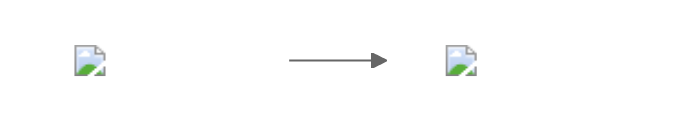

# Mermaid Snippets

## Examples

### Replace shapes with AWS Icons 

``` mermaid
%%{init: {'theme': 'neutral' } }%%
graph LR
classDef clear fill:none,stroke:none;
A[<img src='https://raw.githubusercontent.com/awslabs/aws-icons-for-plantuml/v11.1/dist/ApplicationIntegration/APIGateway.png' />]:::clear --> B[<img src='https://raw.githubusercontent.com/awslabs/aws-icons-for-plantuml/v11.1/dist/Compute/Lambda.png'/>]:::clear

```

## License

GPL 2.0