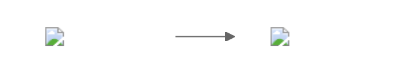

# Mermaid Snippets

## Examples

### Replace shapes with AWS Icons 

*NOTE* Images only seem to render if html special characters are used to specify image URL

- Renders images in VSCode livereload, not in Gitlab/Github

- mermaid-js/mermaid #548 mentions this problem

Using html special characters is mentioned but example given doesn't work at time of writing.
https://github.com/mermaid-js/mermaid/issues/548#issuecomment-324887734

``` mermaid
%%{init: {'theme': 'neutral' } }%%
graph LR
classDef clear fill:none,stroke:none;
D-->X((&lt;img src&#61;&#39;/address/to/image.png&#39; width&#61;&#39;desired_width&#39; /&gt;))
```

## License

GPL 2.0
